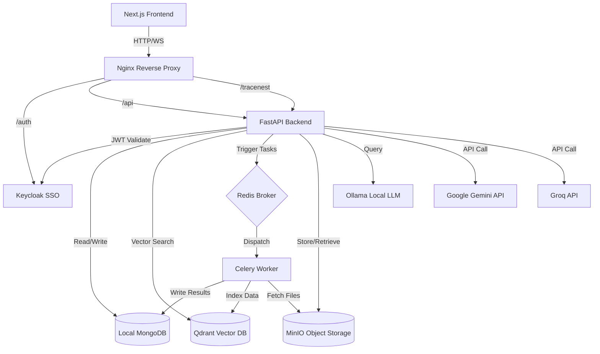
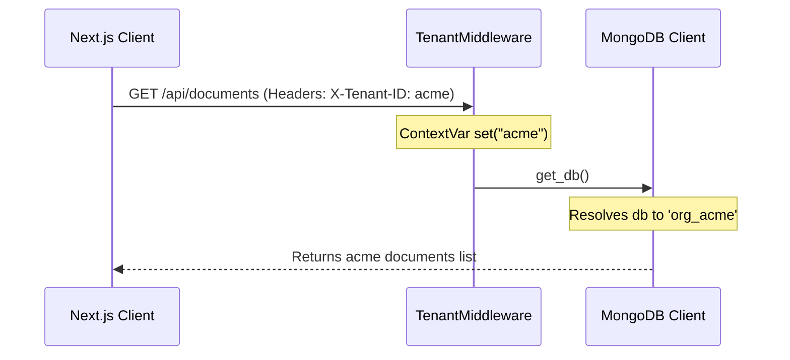

# 01. TenantMind AI: Project Overview & Vision

TenantMind AI is an enterprise-grade, multi-tenant property management platform designed to leverage state-of-the-art Artificial Intelligence (AI) to automate tenant communications, lease parsing, maintenance dispatching, and rent processing. By placing Retrieval-Augmented Generation (RAG) and Model Context Protocol (MCP) tool routing at the core of its architecture, TenantMind AI bridges the gap between static databases and dynamic, secure tenant interactions.

---

## 1. Executive Summary & Problem Statement

Traditional property management is plagued by inefficiencies, slow response times, and manual labor. 
- **Communication Bottlenecks**: Landlords and property managers spend hours answering repetitive questions about lease clauses, utility allocations, and building rules.
- **Maintenance Delay**: Routing work orders to local plumbers, electricians, or HVAC specialists requires manual dispatch, triage, and status follow-ups.
- **Audit & Compliance Risks**: Processing paper or unformatted digital lease agreements leads to data entry errors, missing compliance checks, and a lack of standardized audit trails.
- **Security & Authorization Deficits**: Many modern property portals lack strict data segregation, exposing sensitive financial and background screening documents to unauthorized roles.

TenantMind AI resolves these challenges by introducing an intelligent, resilient microservices framework that orchestrates FastAPI, Next.js, Keycloak OIDC, Qdrant Vector search, Celery, and MongoDB.

---

## 2. Core Vision & System Goals

* **Automated Lease Querying**: Enable tenants to receive instant, legally grounded answers about their lease terms using RAG over signed PDF agreements.
* **Intelligent Maintenance Routing**: Triage and categorize incoming tenant maintenance requests using NLP classifier models, dispatching them to vendors without human intervention unless flagged as high-risk.
* **Multi-Tenant Data Isolation**: Enforce strict data boundaries using tenant-specific scopes verified dynamically against Keycloak OIDC tokens.
* **Human-in-the-Loop AI Control**: Incorporate Model Context Protocol (MCP) gateways to classify AI tool execution risk, securing high-risk commands behind an approval workflow.
* **Resilient Infrastructure**: Construct a multi-tier fallback architecture for large language model (LLM) calls to guarantee service availability even during API outages.

---

## 3. System Architecture & Component Topology

### A. Reverse Proxy (Nginx)
The single entry point for all traffic. It handles SSL termination, client connection pooling, and routes requests to the Next.js frontend, Keycloak, or FastAPI backend.

### B. Identity Provider (Keycloak)
An open-source identity and access management solution. Enforces OAuth2/OIDC protocols, manages user credentials, and mints signed JWT tokens containing organization metadata and roles (`Super Admin`, `Organization Owner`, `Manager`, `Tenant`).

### C. Backend Engine (FastAPI)
A high-performance Python web framework that implements:
- Dynamic database routing (MongoDB).
- RAG coordination (Qdrant & SentenceTransformers).
- Multi-model LLM fallback routing (Gemini -> Groq -> OpenRouter -> Ollama).
- MCP permission evaluation.
- Telemetry middleware (TraceNest).

### D. Task Queue (Celery & Redis)
Redis acts as a memory broker storing job descriptions. Celery workers fetch tasks (like document parsing and embedding generation) and process them asynchronously in the background.

---

## 4. Feature Set & Functional Workflows

### A. Dynamic Tenant Context Isolation
Multi-tenancy is enforced at the database and storage layers:
- **MongoDB**: Requests from tenant `acme` are dynamically routed to database `org_acme`.
- **MinIO**: Uploaded documents are saved under tenant-isolated buckets (`org-acme-bucket`).
- **Qdrant**: Embeddings are indexed into tenant-segregated vector collections (`org_acme_vectors`).

### B. Retrieval-Augmented Generation (RAG)
1. **Document Upload**: A PDF/Word lease is uploaded by the landlord.
2. **Parsing**: Celery extracts text, scans for potential secrets (e.g. AWS keys) or prompt injections.
3. **Chunking**: Text is split into overlapping sections.
4. **Embedding**: sentence-transformers convert text into vectors.
5. **Indexing**: Vectors are loaded into Qdrant.
6. **Chat Query**: A tenant asks about utility bills. The system searches Qdrant, extracts relevant chunks, inserts them as context in the prompt, and gets the answer from the LLM.

### C. Model Context Protocol (MCP) Tool Routing & Approvals
Allows the AI assistant to perform actions (like sending notifications or querying ledger records).
1. **Risk Evaluation**: Tools are graded as `low`, `medium`, `high`, or `critical`.
2. **Auto-Approval**: Low-risk actions (e.g. read FAQ) execute immediately.
3. **Action Queue**: High-risk actions (e.g. override rent status) create a pending approval document in MongoDB. The action is paused.
4. **Review Dashboard**: Landlords see the pending action, inspect parameters, and click "Approve" or "Reject".

---

## 5. User Guides & Interaction Scenarios

### A. Tenant Persona
- **Scenario**: Querying lease renewal dates.
- **Workflow**:
  1. Login to Tenant Portal.
  2. Open Chat Assistant.
  3. Type: *"When do I need to notify the landlord about lease renewal?"*
  4. The AI retrieves their lease, reads the "Termination/Renewal" clause, and replies: *"According to Section 18, you must submit a written notice at least 60 days before September 31st, 2026."*

### B. Landlord / Property Manager Persona
- **Scenario**: Auditing system log actions.
- **Workflow**:
  1. Login to Landlord Dashboard.
  2. Click on **Audit Logs** to view MongoDB database logs.
  3. Click on **TraceNest Telemetry** at `/tracenest` to watch real-time API logs, response statuses, and execution latencies in a visual dark console.
  4. View **Approvals Panel** to review AI-generated action triggers before execution.
